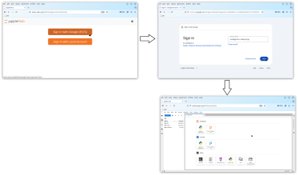
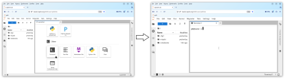
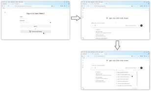
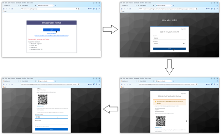
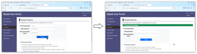
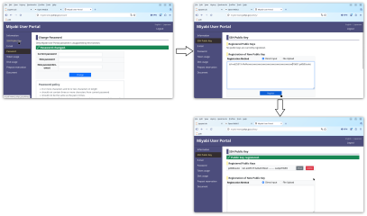
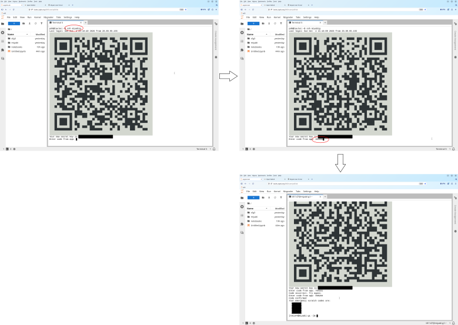
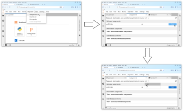
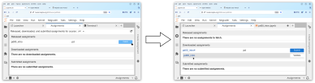

<link rel="stylesheet" href="../scripts/style.css">

# Getting Started with the Course Environment

## Overview of the Environment

- [taulec](https://taulec.zapto.org:8000/) server
- [Miyabi](https://miyabi-www.jcahpc.jp/)  supercomputer ([sytem overview](https://www.cc.u-tokyo.ac.jp/en/supercomputer/miyabi/system.php))
- AI
  - [Open WebUI Chat](https://taulec.zapto.org:3000/)
  - Coding agent (OpenCode)

[{width=400pt}](svg/overview.svg)

- Miyabi is where you are supposed to do most of your programming work
- You use taulec server to
  - receive exercise materials,
  - edit, compile, and run the program, 
  - use AI for help (Jupyter AI, OpenCode, and Open WebUI), and
  - submit assignments 
- We might also use taulec server for programming exercise when Miyabi is unavailable (or too crowded)
- Below, I walk you through procedures to set the environment ready for you
- If you are reading this page before the first lecture (2026-10-05 16:50) starts, I am encouraged to finish what you can do now before the class

## Receive You Accounts

- Go to [UTOL course page](https://utol.ecc.u-tokyo.ac.jp/lms/course?idnumber=2026_4884_4840-1004_01&_cid=84201a98-6b6b-438b-a052-1ee1a651ee9c) and submit the assignment "Assignment 0: send info to issue your account for exercise environment"
  - If you cannot see the course page, register yourself in UTOL
  - Note: self-register in UTOL does not enroll you to the course for credit, which must be separately done in [UTAS](https://utas.adm.u-tokyo.ac.jp/) when you decide to do so
  - Enter your UTokyo Google account (xxxx@g.ecc.u-tokyo.ac.jp) and submit
	- I've received from a few of you addresses not exactly in this domain (@g.ecc.u-tokyo.ac.jp); please resubmit it if possible.  If it's not possible, please let me know in the UTOL messsage
- Then get feedback from the instructor for it, which gives you
  - **A:** user name on Miyabi and Miyabi User Portal
  - **B:** password for Miyabi User Portal
- At this point, you are given access to
  - [Jupyter server on taulec](https://taulec.zapto.org:8000/), with your UTokyo Google account (xxxx@g.ecc.u-tokyo.ac.jp)
    - Jupyter AI you can call from within Jupyter (OpenCode)
	- OpenCode coding agent you can call outside Jupyter
  - [AI Chat on taulec](https://taulec.zapto.org:3000/), with the same Google account
  - [Miyabi User Portal](https://miyabi-www.jcahpc.jp/) (not the machine itself), with **A** and **B**
  
- To finish the set up, you need to 
  - generate SSH key on taulec
  - register the SSH public key for Miyabi
  - Note: SSH is a secure remote shell commonly used to login remote servers

Exact procedures are described below. Be patient!

## taulec Jupyter server

- Open [https://taulec.zapto.org:8000/](https://taulec.zapto.org:8000/)
- When asked to sign in, sign in with UTokyo Google account (xxx@g.ecc.u-tokyo.ac.jp)

[{width=400pt}](svg/jupyter_login.svg)

- In the launcher page, launch "Terminal" and play with it

[{width=400pt}](svg/jupyter_terminal.svg)


## AI Chat for Questions and Conversations

- Open [https://taulec.zapto.org:3000/](https://taulec.zapto.org:3000/)
- When asked to sign in, sign in with UTokyo Google account (xxx@g.ecc.u-tokyo.ac.jp)
- Choose a model from the model chooser in the lower right corner of the chat box and say anything (e.g., hello)

[{width=400pt}](svg/open_webui.svg)

## Miyabi Supercomputer

Now move on to Miyabi, the main environment for learning parallel programming

- The set up procedure is a bit complex, so read them carefully
- Steps you must go through until you are able to use Miyabi are
1. Install Authenticator App on Your Phone (if you haven't)
1. Open Miyabi User Portal, setting up multifactor authentication and changing the password along the way
1. Generate SSH key on taulec
1. Register the generated SSH public key to the Miyabi user portal
1. SSH Miyabi from taulec, setting up multifactor authentication along the way

### Install Authenticator App on Your Phone (if you haven't)

- Both Miyabi User Portal and Miyabi supercomputer itself require multifactor authentication
- You can use the same authenticator app you are using for UTokyo Account (e.g., Microsoft Authenticator)
  - [Android](https://play.google.com/store/apps/details?id=com.azure.authenticator&hl=en)
  - [iPhone](https://apps.apple.com/us/app/microsoft-authenticator/id983156458)
- Install it before you proceed in case you haven't

### Open Miyabi Portal 

- Have your phone with authenticator app (see above) installed ready with you
- Log in [Miyabi User Portal](https://miyabi-www.jcahpc.jp/login)
  - use (A) the user name (t8....) and (B) password you received from UTOL feedback
- You will be asked to scan QR code with your authenticator app, so scan it with the authenticator app
- Open the entry just created in the app (named `t81xxx@miyabi`) and show the 6-digit verification code; enter the code on the page

[{width=400pt}](svg/miyabi_portal_login.svg)

- You will then be asked to change the password; I recommend to use a random password generator like `pwgen` (`pwgen -y 16 1`).  It is available in taulec (open "Terminal" in the launcher page)

[{width=400pt}](svg/miyabi_portal_pw_change.svg)

- You are asked to enter the 6 digit code every time you login the portal

### Generate SSH key on taulec

- From [Jupyter on taulec](https://taulec.zapto.org:8000/), launch "Terminal"

[{width=400pt}](svg/jupyter_terminal.svg)

- Generate an SSH keypair `~/.ssh/id_ed25519` and `~/.ssh/id_ed25519.pub` by the following command
```
taulec$ ssh-keygen
```
- You are asked to set a passphrase to encrypt the private key; do not leave it empty.
- Display the public key and copy the whole line to the clipboard
```
taulec$ cat ~/.ssh/*.pub
ssh-ed25519 AAAA...................T0kEO t81xxx@taulec
```
- On Miyabi User Portal, click "SSH Public key" on the left menu
- Paste the public key string (copied above) into the box

[{width=400pt}](svg/miyabi_register_key.svg)

### SSH Miyabi from taulec

- Now you should be able to SSH Miyabi from taulec 
- From [Jupyter on taulec](https://taulec.zapto.org:8000/), launch "Terminal" and execute the following
```
taulec$ ssh miyabig
```
- On the first login, it displays a QR code with ASCII art you are asked to scan
- Open the authenticator app and scan it
- Open the entry just created in the app (named `t81xxx@miyabi-g?`) and show the 6-digit verification code; enter the code the the terminal

[{width=400pt}](svg/miyabi_ssh_qr.svg)

- If your phone does not recognize the QR code, it is probably because of wrong fonts; your OS uses a font that shows the code not as a square but as a tall rectangle; let me know if that happens
- Once you succeed, log out and ssh again; this time, you will _not_ be asked to enter the verfication code
- The reason is the configuration below, which skips verification code for the next six hours

### FYI: Under the Hood: `~/.ssh/config`

- By default, every time you SSH Miyabi, you are asked to enter 6-digit code
- It is very inconvenient, so `taulec` has been configured for you
- It is in `~/.ssh/config`; you will find something like this

```
Host miyabig
    HostName miyabi-g.jcahpc.jp
    User t81xxx
    ControlMaster auto
    ControlPath ~/.ssh/cm_%r@%h:%p
    ControlPersist 6h
    ServerAliveInterval 60
```

- `miyabig` serves as the alias for `miyabi-g.jcahpc.jp` 
- `User t81xxx` allows you to omit user name (`t81xxx@`)
- The three lines that follow (`ControlXXXX ...`) together allow you to reuse an authenticated session from taulec to miyabi, so you do not have to enter verification code every time

## Final Steps: Fetching Exercise Material

### Mounting Miyabi File System on taulec

- taulec and Miyabi are two separate machines with separate user set and file system
- To seamlessly make files on Miyabi from taulec, we use `sshfs`
- This is the state we are headed

[{width=400pt}](svg/overview.svg)

- From [Jupyter on taulec](https://taulec.zapto.org:8000/), launch "Terminal" and execute the following (repalce t81xxx with your user name on Miyabi)
```
taulec$ ls ~/miyabi     # miyabi is an empty directory
taulec$ sshfs miyabig:/work/gt81/share/home/t81xxx ~/miyabi
taulec$ df
  ...
miyabig:/work/gt81/share/home/t81149 10865838112000 3914807077240 6841070095012  37% /home/pd0/miyabi
```
- The `sshfs` command "mounts" `/work/gt81/share/home/t81xxx` directory on `miyabig` to `~/miyabi` on taulec, meaning that the former directory is now visiable as the latter
  - On taulec, every access to any file under `~/miyabi` directory actually accesses Miyabi
  - Note also that `~/notebooks/pd` is a symlink to `~/miyabig/notebooks/pd`
  - Therefore, every access to any file under `~/notebooks/pd` directory actually accesses Miyabi
  
- The `df` commands shows the status of mount. If the line like `miyabig:/work/gt81/share/home/t81xxx ... /home/u26xxx/miyabi` appears, your directory is mounted 
- When you do your exercise, make sure your `~/miyabi` directory is mounted
- Since the above `sshfs` command is too long and difficult to remember to type every time, there is `mount-miyabi` command for it
```
taulec$ mount-miyabi      # mount
taulec$ mount-miyabi -u   # unmount
```

### (Finally!) Fetch an Exercise and Start Playing!

- From menu, Nbgrader -> Assignment List
- Select `pd` from the drop down menu next to "Released, downloaded, and submitted assignments for course:"

[{width=400pt}](svg/select_course.svg)

- Fetch an assignment from "Released assignments"
- Open the notebook and start working on it!

[{width=400pt}](svg/fetch_assignment.svg) 

## (Optional) Directly SSH Miyabi from Your PC

- In this course, the canonical way to access Miyabi is via Jupyter on taulec
- That is, you sign in Jupyter on taulec using Google account and then SSH Miyabi from taulec
- The reasons for doing so are
  - We want to use Jupyter for giving exercise materials 
  - We want to use coding agent AI on taulec, which is not allowed to run on Miyabi
- However, the main work of editing, compiling, and running programs can be done by directly logging into Miyabi and it is simpler if you have no issues in character-based user interface (CUI)
- If you are such a type,
  - Register your SSH public key corresponding to the private key on your local PC via [Miyabi User Portal](https://miyabi-www.jcahpc.jp/login)
  - Just remember that files you fetched in Jupyter are in `/work/gt81/share/home/$USER/notebooks/pd`; do your work there

